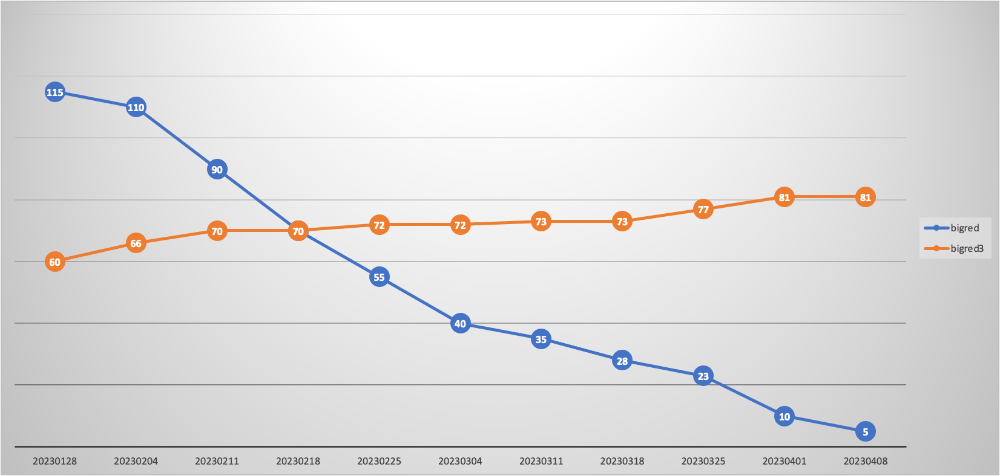
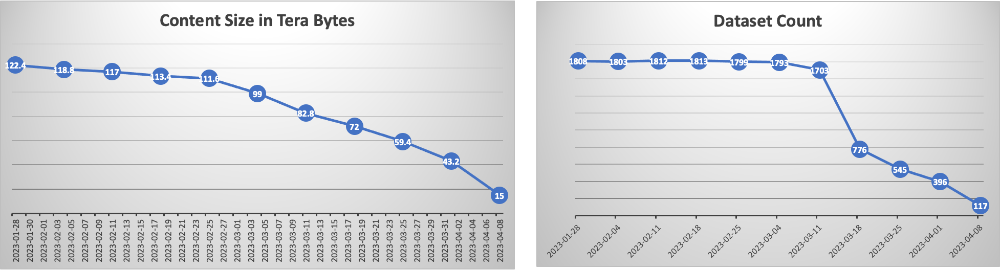

# Decommissioning a Data Platform

https://confluence.target.com/display/EDABI/Path+to+BR2+Decommission

## Overview
The challenging task of decommissioning our team's space from the old Hadoop platform (BigRed2) and migrating to a new system (BigRed3) was my introduction to a first "major" project at Target. Under the guidance of a lead engineer, I played a crucial role in the systematic decomissioning of our teams space in BigRed2.

### Background
The decommissioning strategy was meticulously planned from the start. I was involved in creating a comprehensive inventory of the Guest team's assets on BigRed2, identifying datasets for early decommission based on usage metrics, and planning the phased removal process.

### Decommissioning Steps
1. **Communication**
- Engaged in collaborative discussions with all stakeholders
- Ensured continuous communication with Product Managers and Engineers throughout the process

2. **Scream Tests**: 
- Conducted the decommissioning process for approximately 110 BigRed2 jobs.
- Implemented permission locks and renamed tables, signaling their impending deletion.
- This step was crucial in identifying any active users who had not yet transitioned, since they "screamed" out they couldn't access the tables

3. **Drop Table**: 
-Executed the final step in the decommissioning process, which was deletion of the identified tables
- The dropping of all out decomisisoned tables signified the successful closure or our decomissioning work

### Results
- Decommissioned over 110 jobs from BigRed2.
- Freed approximately 100TB of space from the old data platform.
- Eliminated over 1700 Hive tables.
- Led the Data Engineering team in a complete migration from the old platform.

Job Inventory

### Presentation
A really cool moment was presenting this decommissioning journey to Target's CIO, Brett Craig. This was a great opportunity to showcase our team's efforts through this journey!
