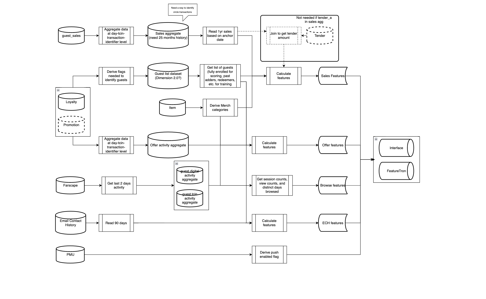

# Guest Features

https://confluence.target.com/display/EDABI/MVP%3A+Guest+Feature+Datasets

## Overview
The Guest Features was a challenging but very rewarding project where I teamed up alongside three Lead Engineers, which was focused on creating the first iteration of Feature Datasets within the Guest Space. The goal of this project was to lay the foundation within our team for bringing our raw certified data to usable Features ready to be ingested by ML Models. This also involved learning how we can centralize existing processes built by other teams into our own Feature processing. 

A Feature is simply a metric that is ready to be used within ML Models to provide future predicitons. An example of a Feature could be "The amount of Profile Sales for a Guest within a 30 day period".

## Background
We began with an initial analysis that provided the technical details needed for the design. It also provided a list of potential Features to create in the first iteration. This laid down the groundwork for our design.

### Design
The designs goal was to create batches of specific Features based off four different data products (Offer, Sales, Browse, Email Contact History)

The design extracts 2 years relevant data, splits it into training/scoring data, aggregate it to the different levels, calculate features, and push this to the feature store

### Development
I was assigned in developing the Sales Features, which was very challenging as it contained by far the most amount of Features (over 400). I collaborated closely with the Leads, and gained extremely valuable insight on the full development cycle process, and gained tons of specific experience with understanding design/implementation. 

We approached this development by starting small and ending big. We built out the correct logic with proper extraction, joining of data, aggregation, and feature calculations. This was a huge HQL script, over 1700 lines of code!

### Refinement
From there we focused on improving performance. Huge improvements came after we implemented a process that leveraged already existing features into other feature calculation, which cut the processing time by around ~6 hours! This brings the existing process to currently be at ~15 hours, but additional enhancements will cut this.

## Results
- Successfully implemented Guest Teams first iteration of Feature datasets

- Laid the foundation for future creation and collaboration on Guest Features

- Absorbs engineering costs on other teams who are calculating Guest Features

