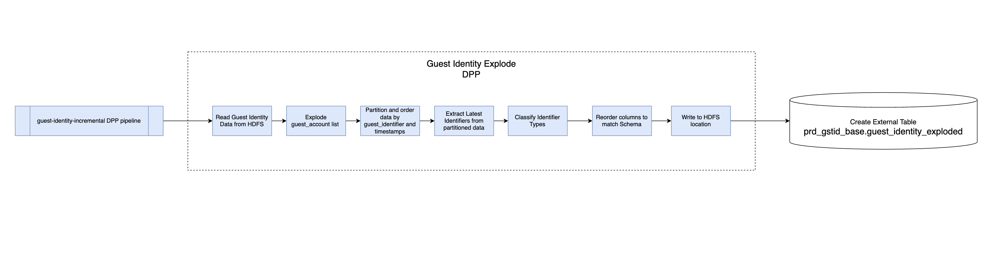

# Guest Identity Data Integration

https://confluence.target.com/display/~Z00B7TF/Identity+Data+Explode+Processes

## Background
This project was an initiative to optimize our Guest Identity processes by consolidating multiple cross-reference tables into a single, comprehensive table

I led this complex task from analysis to implementation. My responsibilities included analyzing each process, designing a new integrated approach, and developing/implementing the design, while guaranteeing data integrity and no data loss.

This new process was a main cross-reference table linking Guest Cluster Ids to Guest Identifiers, a crucial step for streamlining data association. This table is now a key component in our internal pipelines, significantly enhancing guest identification efficiency

### Analysis Approach
The objective was to unify three different data processes into one, without compromising data granularity or data loss. The approach was as follows:

1. **Understand Current Processes**: Assessed the existing processes, noting their refresh rates, schemas, purposes, outputs, etc

2. **Analyze Overlaps**: Identified commonalities between each process to determine how to potentially consolidate the processes

3. **Schema Consolidation**: Reassessed and revised schemas to ensure all required data columns were included in the new process

## Design/Development
From this detailed analysis, the design for the new consolidated process was created. The main focus was to essentially explode the Identity data to a Guest Identifier grain, while enriching this data with other columns present within Identity

High Level Design ->

Development was carried out using Spark/Scala to build the pipeline. This was a very challenging development, as I had to have a complete understanding of the Guest Identity product. There were multiple scenarios that had to be accounted for and there were multiple iterations of logic to address for these scenarios. This required lots of patience and learning, but was a very rewarding experience when the validations finally lined up with my logic.

## Results

- **Increased Efficiency**: This new single process replaced three exising ones, reducing redundancy and utilizing fewer resources

- **Better Scalability**: The consolidated pipeline, built on Spark and Scala, is much more scalable and well-suited for future growth

- ***Reduced Support**: Combining processes reduced support costs and risk, as we now only have one process to support

## Pull Requests
- **Spark/Scala pipeline**: https://git.target.com/data-engineering-gst-interactions/guest_identity_incremental/pull/127/files