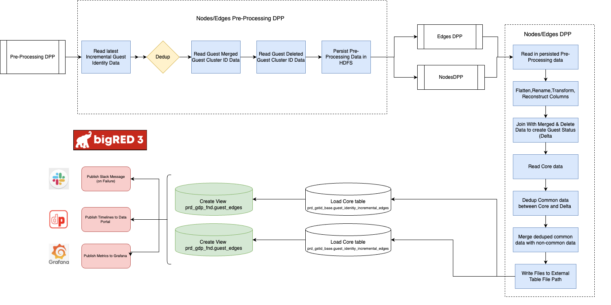

# Guest Nodes and Edges 

## Introduction:
On joining the Guest Interactions team, my initial assignment was to stablize the Guest Nodes/Edges job and then redesign, develop, and implement a new more stable process. This old process faced frequent job failures that were very costly and time-consuming to our team. By streamlining the process our aim was to:
1. Enhance efficiency
2. Eliminate support cost
3. Increase data accuracy

The Guest Nodes and Edges process essentially exposes data from the Guest Identity Graph as is. It brings value by providing the most recent snapshot of a Guest within the Graph, which is useful for Graph verfication when a merge or delete happens

## Background
The first step in stabilizing the Nodes process involved a thorough investigation to understand the root cause of the job failures. This required a deep dive into the infrastructure of the job and the issues it was encountering.

Upon identifying memory issues as the primary cause of the failures, I applied a hotfix to the job. This involved a complete revamp of the HQL script that was being executed. The script was optimized to prevent it from running into memory issues, which had been causing the failures.

This solution effectively stabilized the process for approximately two months. However, the memory issues eventually resurfaced, indicating the need for a redesign

## Redesign
https://confluence.target.com/display/~Z00B7TF/Guest+Nodes+Redesign

The redesign focused on:
1. Consolidating Nodes/Edges into one parallel process
2. Transitioning to DataFrame approach provided by Spark instead of HQL

## Development
The development was a length process since rewriting the processes in Spark/Scala was a huge undertaking. I created an entirely new repo for this, which I had to set up new pipelines, logic, oozie workflows, metrics, test cases, hql scripts, data validation, integration testing, etc. 

This also required a full understanding of Guest Identity, which was an entirely new product to me. Guest Identity is a challenging space, as it requires an in depth knowledge of the data and scenarios with the Guest Identity Graph. 

Although it was challenging, the end result of an effiecient, consistant, and consolidated process was a very rewarding and cool experience once it hit Production!

## Results 
- New process averages 1-1.5 hours runs in parallel, where the old processes took roughly 4-6 hours each to run. This is a substantial improvement

- Rewriting our process in Spark/Scala solved the initial failures, reducing support cost to nearly zero, saving team resources and reducing risk

- Streamlining the Nodes/Edges process brings confidence in the ability for others teams to confidently use thse datasets for Graph Analysis, ensuring percise identifications of our Guests

